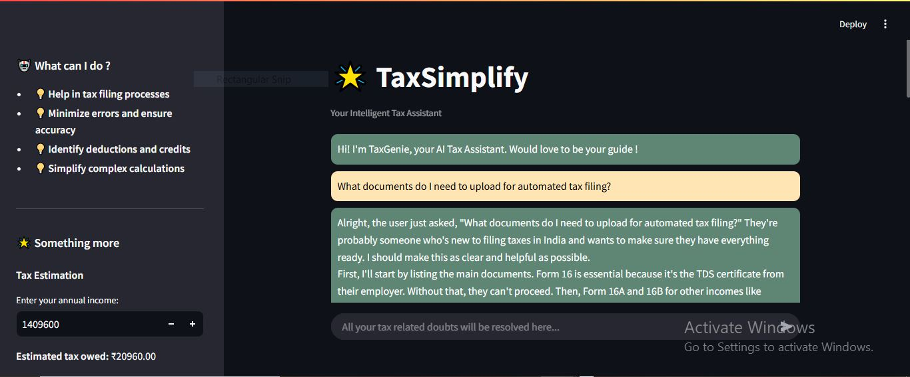
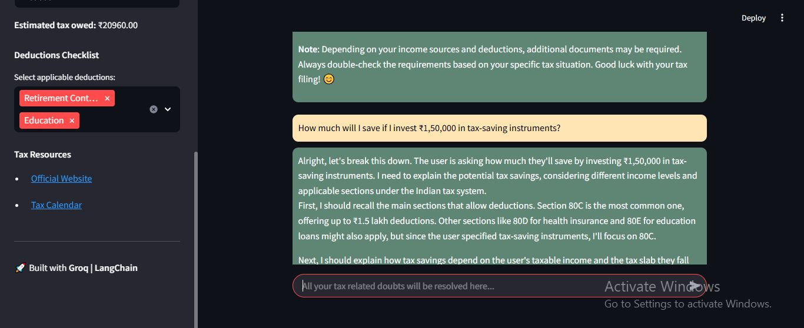

# TaxSimplify - AI Tax Assistant

## Overview
TaxSimplify is a smart AI-powered tax assistant that streamlines tax filing by automating complex calculations, optimizing deductions, and ensuring accuracy. Whether you're an individual or a business, TaxSimplify helps you maximize savings, minimize errors, and stay compliant with tax regulations. Built with Streamlit and Groq AI, it provides an intuitive and efficient platform for hassle-free tax management. Built using Streamlit and Groq AI, it provides users with a seamless experience for tax estimation and guidance.

## Features
- 📊 **Automated Tax Calculation** - Instantly calculates estimated taxes based on user input.
- 💼 **Deductions Guidance** - Helps users maximize their savings by suggesting applicable tax deductions.
- 🔍 **Error Minimization** - Identifies and corrects potential tax filing errors.
- 📝 **Tax Filing Assistance** - Guides users through the documentation and process required for filing taxes.
- 🌍 **User-Friendly UI** - A sleek, interactive interface powered by Streamlit.

## Project Structure
```
TaxSimplify/
│── app.py             # Main application file (Streamlit UI & backend logic)
│── requirements.txt   # Dependencies list
│── README.md          # Project documentation
│── groq/              # AI Model configurations
│── .env               # API keys and environment variables
```

## Installation & Setup
Follow these steps to set up and run the TaxSimplify assistant locally:

### 1️⃣ Clone the Repository
```bash
git clone https://github.com/your-username/taxsimplify.git
cd taxsimplify
```

### 2️⃣ Install Dependencies
```bash
pip install -r requirements.txt
```

### 3️⃣ Set Up Environment Variables
For **Windows (PowerShell):**
```powershell
$env:GROQ_API_KEY="your-api-key"
```
For **macOS/Linux (Terminal):**
```bash
export GROQ_API_KEY="your-api-key"
```

### 4️⃣ Run the Application
```bash
streamlit run app.py
```

### 5️⃣ Access the Application
Once the server starts, open your browser and go to:
```
http://localhost:8501
```

## Screenshots
Here’s a glimpse of TaxSimplify in action:

### **Home Page & Features**


### **Tax Calculation & User Interaction**


## License
This project is licensed under the **MIT License**.

## Acknowledgements
- Streamlit for the amazing web app framework
- Groq for the powerful language models

## Contact
For any queries or support, reach out to: **shrreya.hole24@gmail.com**

🚀 **Happy Tax Filing with TaxSimplify!**

